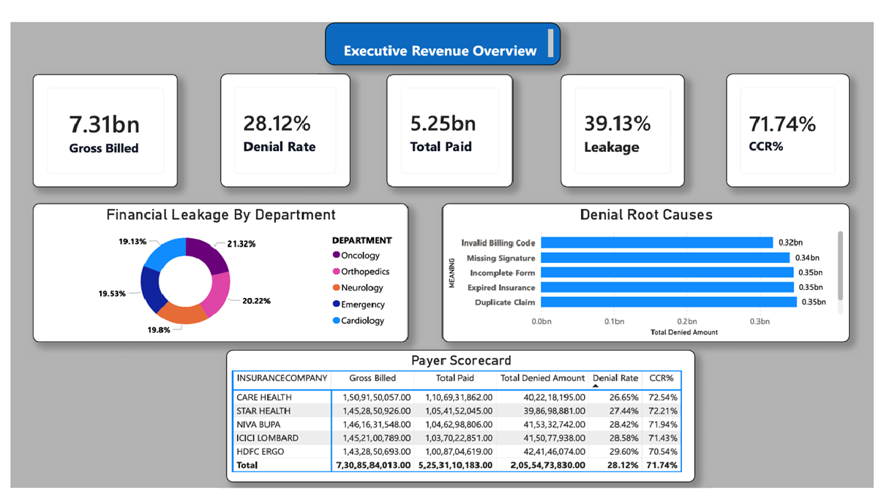
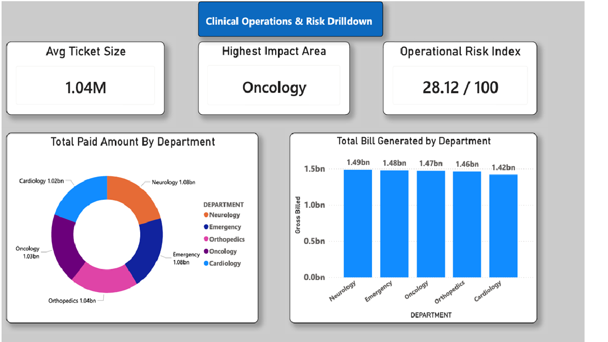
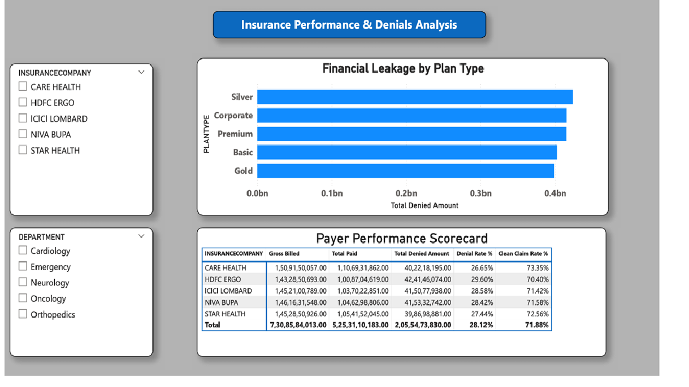

# Healthcare Data Analytics: Claim Denials Optimization

## Project Overview

This project analyzes how **administrative errors, departmental processes, and payer behavior** impact a hospital's **revenue cycle and claim denial rates** using real billing and clinical data.

The analysis combines:

* **Hospital Billing & Clinical Data**
* **Insurance Payer Performance Metrics**

The goal is to uncover **root causes of financial leakage**, **operational risks**, and **recovery opportunities** across different departments and insurance plans.

---

## Objective

> To identify the operational and administrative inefficiencies causing a massive ₹2.05 Billion in claim rejections, and to provide actionable insights to improve the hospital's Clean Claim Rate (CCR) and maximize revenue recovery.

---

## Project Structure

```
Healthcare-Claim-Denial-Analytics/
│──Excel_Analysis
    ├──Hospital_Claim_Audit.xlsx

├── Raw_data/
│   ├── Billing_Table.xlsx
│   ├── Clinical_Table.xlsx
│   └── Insurance_Table.xlsx
|   |──Denial_Reason_Lookup.xlsx
|   |──Patients_Table.xlsx

|───SQL_Scripts/
│   ├── 01_schema_setup.sql
│   ├── 02_etl_transformations.sql
│   └── 03_business_analytics.sql
    
│
├── PowerBI_Dashboard/
│   ├── claim-denials-dashboard.pbix
|   |──Final Report.pdf
│   ├── page1_executive.png
│   ├── page2_operations.png
│   └── page3_payer_scorecard.png
│
├── README.md
```

---

## Tools & Technologies

* **Power BI** (Dashboarding, Data Visualization & Storytelling)
* **DAX** (Advanced Data Analysis Expressions for KPIs)
* **Power Query** (ETL, Data Cleaning & Transformation)
* **Data Modeling** (Star Schema implementation)

---

## Methodology

### 1. Data Cleaning & Transformation
* Removed inconsistencies, handled missing relationships, and created bridge tables.
* Standardized financial formats and categorized denial codes.

### 2. Feature Engineering (DAX Measures)
Created key financial and operational metrics:
* Gross Billed Amount (₹7.31bn)
* Total Denied Amount (₹2.05bn)
* Denial Rate % (28.12%)
* Clean Claim Rate (CCR) % (71.74%)
* Average Ticket Size (₹1.04M)

### 3. Data Modeling
* Connected Clinical, Patient, Insurance, and Billing tables using a robust 1-to-many relationship model.

### 4. Exploratory Data Analysis (EDA)
* Analyzed **financial leakage by department**.
* Compared **Payer (Insurance) performance and approval patterns**.
* Studied **root causes for denied claims**.

### 5. Dashboard Development (Power BI)
Built an interactive **3-page dashboard** to present enterprise-grade insights:

---

## Dashboard Preview

### Page 1: Executive Revenue Overview



---

### Page 2: Clinical Operations & Risk Drilldown



---

### Page 3: Insurance Performance & Denials Analysis


---

## Key Insights

* **Massive Financial Leakage:** Out of ₹7.31 Billion billed, **₹2.05 Billion (28.12%)** is denied, indicating a high-risk operational zone.
* **Costly Errors:** The Average Ticket Size is **₹1.04 Million**, meaning every single avoidable denial heavily impacts cash flow.
* **Administrative Failures:** The top 3 root causes—Duplicate Claims, Expired Insurance, and Incomplete Forms—account for over **₹1.05 Billion** in losses.
* **Departmental Spread:** Leakage is distributed almost equally across all departments (~19-21%), with **Oncology slightly leading (21.32%)**.
* **Payer Discrepancy:** **HDFC Ergo** is the worst-performing insurer (29.60% Denial Rate), while **Care Health** is the best (26.65% Denial Rate, 73.35% CCR).
* **Plan Risk:** **Silver Plans** experience the highest rate of financial leakage compared to Corporate or Premium plans.

---

## Strategy Recommendations

* **Implement Claim Scrubbing Software:** Deploy automated systems to catch duplicate claims and verify active insurance *before* submission to save ₹1.05bn+.
* **Renegotiate with Bottom Payers:** Use the Payer Scorecard to negotiate better terms with HDFC Ergo, or strategically shift patient volume toward Care Health.
* **Automate Signature Workflows:** Since missing signatures and incomplete forms cost ₹0.69bn, implement mandatory digital signature collection at the time of discharge.
* **Target 85%+ CCR:** Setting quarterly departmental targets to improve the Clean Claim Rate from 71.74% to 85% could yield an additional ₹97 Crore+ in direct recovery.

---

## How to Run

1. Clone the repository.
2. Ensure you have Microsoft Power BI Desktop installed.
3. Open the dashboard:

```bash
outputs/claim-denials-dashboard.pbix
```

---

## Key Takeaway

> Hospital revenue leakage is primarily driven by avoidable administrative errors rather than clinical coding issues. Optimizing front-end documentation and holding insurance payers accountable through data can recover billions in lost revenue.

---

## Author

**Abhishek Hiwarkar**
